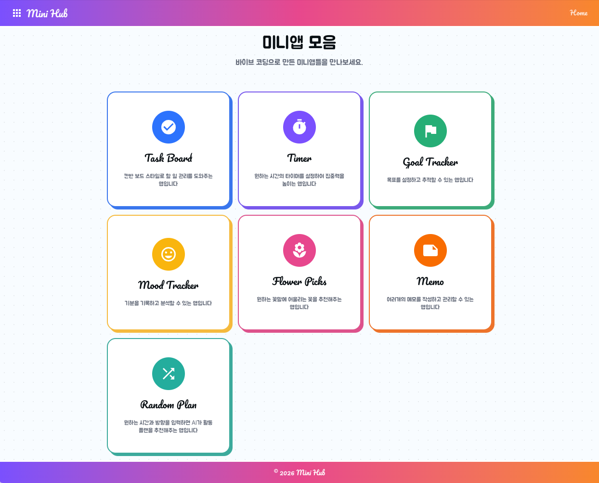

<div align="center">

# 🌈 Mini Hub

바이브 코딩(Claude Code)으로 만든 미니앱 모음 허브입니다.

[](https://minihub-b.netlify.app/)

**🔗 [minihub-b.netlify.app](https://minihub-b.netlify.app/)**

<br/>



</div>

<br/>

## ✨ 앱 목록

| 앱                  | 설명                                         |
| ------------------- | -------------------------------------------- |
| 📋 **Task Board**   | 칸반 스타일의 할 일 관리 보드                |
| ⏱️ **Timer**        | 집중 타이머                                  |
| 🎯 **Goal Tracker** | 목표 설정 및 진행 추적                       |
| 😊 **Mood Tracker** | 데일리 기분 기록 및 차트 분석 (AI)           |
| 🌸 **Flower Picks** | 꽃말 검색 및 추천 (AI)                       |
| 📝 **Memo**         | 메모 작성 및 관리                            |
| 🎲 **Random Plan**  | 시간과 방향을 입력하면 AI가 활동 플랜을 추천 |

<br/>

## 🛠️ 기술 스택

- **Next.js 15** + **React 19**
- **TypeScript**
- **Tailwind CSS 4**
- **shadcn/ui** — UI 컴포넌트
- **recharts** — 차트
- **react-icons** — 아이콘
- **@anthropic-ai/sdk** — AI 기능

<br/>

## 🚀 시작하기

```bash
npm install
npm run dev
```

AI 기능 사용을 위해서는 `.env` 파일에 에 아래 키를 등록해야 합니다.

```
ANTHROPIC_API_KEY=your-api-key
```

<br/>

## ☁️ 배포

[Netlify](https://netlify.com)를 통해 배포되며, `main` 브랜치에 push하면 자동으로 재배포됩니다.

<br/>

## 📂 문서

**[CLAUDE.md](CLAUDE.md)** — Claude Code가 이 프로젝트에서 작업할 때 따르는 규칙과 설계 가이드. 기술 스택, 파일 구조, 앱 추가 방법, 디자인 시스템(키치/네오브루탈리즘) 등이 정의되어 있습니다.

**[docs/](docs/)** — 각 미니앱의 상세 기능 및 개발 방향성 문서.

| 파일                                  | 내용                                       |
| ------------------------------------- | ------------------------------------------ |
| [taskboard.md](docs/taskboard.md)     | 칸반 보드 스타일 할 일 관리 앱 명세        |
| [timer.md](docs/timer.md)             | 집중 타이머 앱 명세                        |
| [goalTracker.md](docs/goalTracker.md) | 목표 설정 및 달력 기반 진행률 관리 앱 명세 |
| [moodTracker.md](docs/moodTracker.md) | 데일리 기분 기록 및 AI 분석 앱 명세        |
| [flowerPicks.md](docs/flowerPicks.md) | AI 꽃말 검색 및 추천 앱 명세               |
| [memo.md](docs/memo.md)               | 메모 작성 및 관리 앱 명세                  |
| [randomPlan.md](docs/randomPlan.md)   | AI 활동 플랜 추천 앱 명세                  |

<br/>

## 📌 규칙

- 각 앱은 완전히 독립된 컴포넌트로 구성
- 데이터는 Local Storage에만 저장 (`minihub_[앱id]` 형식)
- 로그인/인증/데이터베이스 없음
- 단일 컴포넌트 200줄 초과 시 분리
